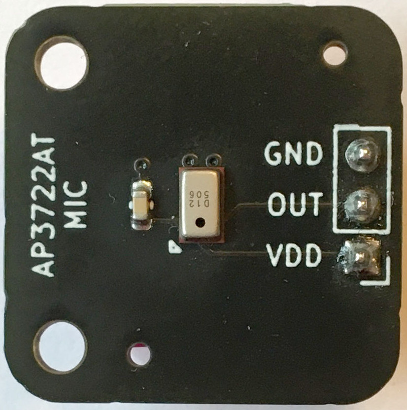
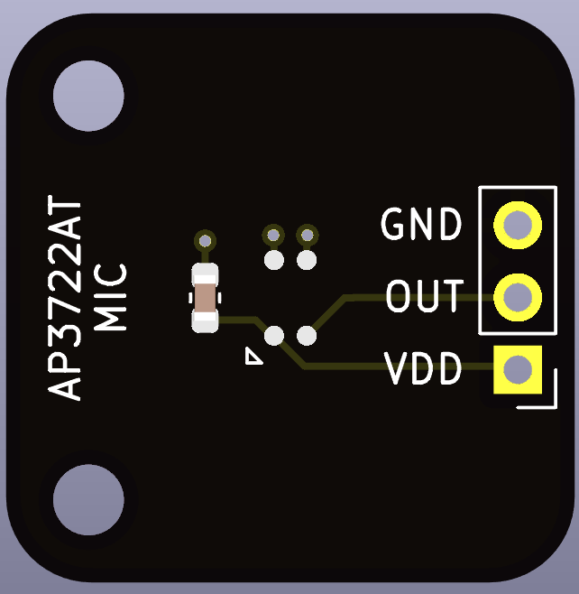

# AP3722AT MEMS microphone breakout

A breakout board for the [AP3722AT](datasheets/2011200934_ALLPOWER-ShenZhen-Quan-Li-Semiconductor-AP3722AT_C918198.pdf) analog mono MEMS microphone.

## Headers

See [datasheet](datasheets/2011200934_ALLPOWER-ShenZhen-Quan-Li-Semiconductor-AP3722AT_C918198.pdf).

## Hand soldered components

* 1x3 2.54 mm headers