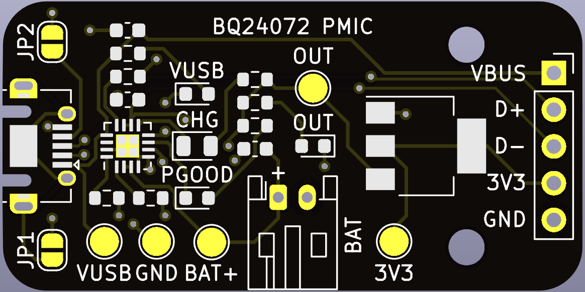

# BQ24072 PMIC board

A USB LiPo battery charger and power-path management board based on [Texas Instruments BQ24072](datasheets/1806131014_Texas-Instruments-BQ24072RGTR_C140288.pdf).

## Pinout

* __VBUS__ - 5V USB bus voltage
* __D-, D+__ - USB data lines
* __3V3__ - 3.3V output voltage 
* __GND__ - Ground

## Connectors

* __BAT__ - LiPo battery. Refer to the + indication to ensure  correct polarity.

## LEDs

* __VUSB__ - USB bus voltage present
* __CHG__ - Charging status indication
* __PGOOD__ - Power good status indication

## Hand soldered components

* 1x5 2.54 mm headers
* 2-pin, 2.0 mm pitch, horizontal JST PH connector (**BAT**)