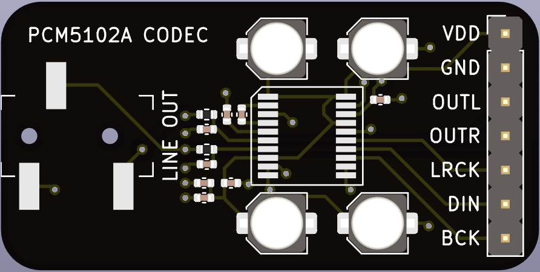

# PCM5102A audio codec breakout board

 

A breakout board for the [PCM5102A audio codec](datasheets/pcm5102a-q1.pdf) with a 3.5mm microphone line out jack.

## Headers

* **GND** - Ground
* **VDD** - 3.3V supply voltage

See [datasheeet](datasheets/pcm5102a-q1.pdf).

## Connectors

* __Line out__ - Line level output

## Hand soldered components

* 1x7 2.54 mm headers