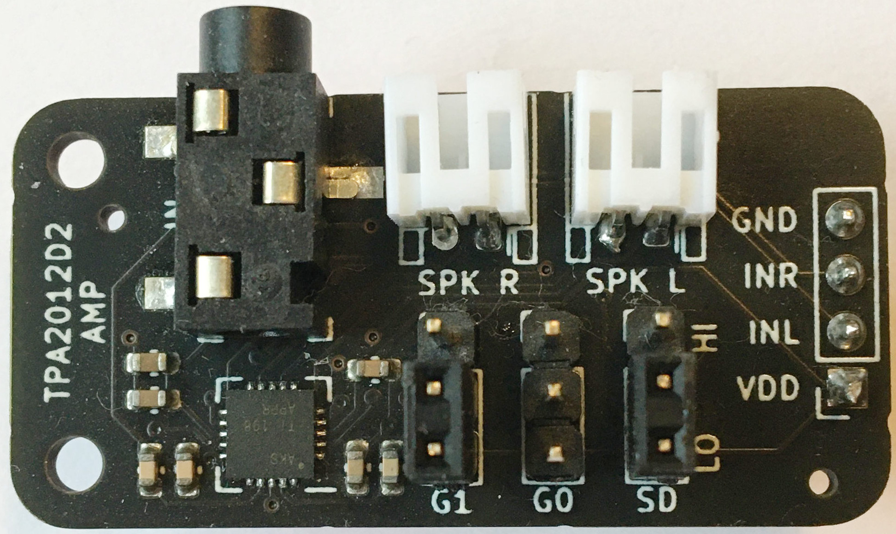
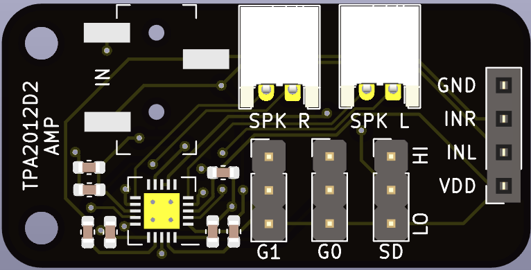

# TPA2012D2 breakout board

A [TPA2012D2](datasheets/1809121818_Texas-Instruments-TPA2012D2RTJR_C7717.pdf) class-D stereo audio power amplifier breakout board with a 3.5mm line input jack.

## Headers

* __GND__ - Ground
* __INL__ and __INR__ - Left and right channel line input. May be used instead of the line input jack.
* __VDD__ - Supply voltage, 2.5V - 5.5V recommended

The __G0__ and __G1__ jumpers control the output gain and the  __SD__ jumper controls the __SDL__ and __SDR__ channel shutdown pins, see [datasheet](datasheets/1809121818_Texas-Instruments-TPA2012D2RTJR_C7717.pdf).

## Connectors

* __SPK L__ - Left speaker output
* __SPK R__ - Right speaker output
* __IN__ - Stereo line input

## Hand soldered components

* 1x4 2.54mm headers
* 1x3 2.54mm headers (__G0__)
* 1x3 2.54mm headers (__G1__)
* 1x3 2.54mm headers (__SD__)
* 2-pin, 2.0 mm pitch, horizontal JST PH connector (**SPK L**)
* 2-pin, 2.0 mm pitch, horizontal JST PH connector (**SPK R**)