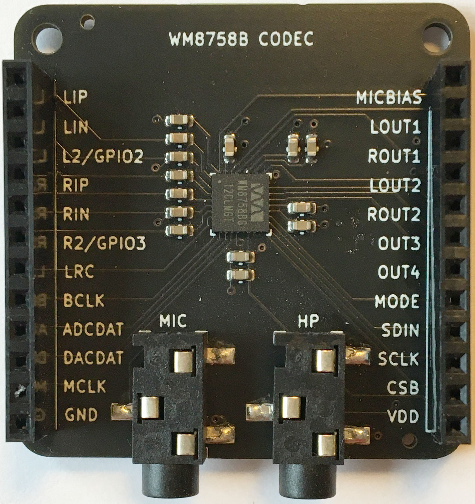
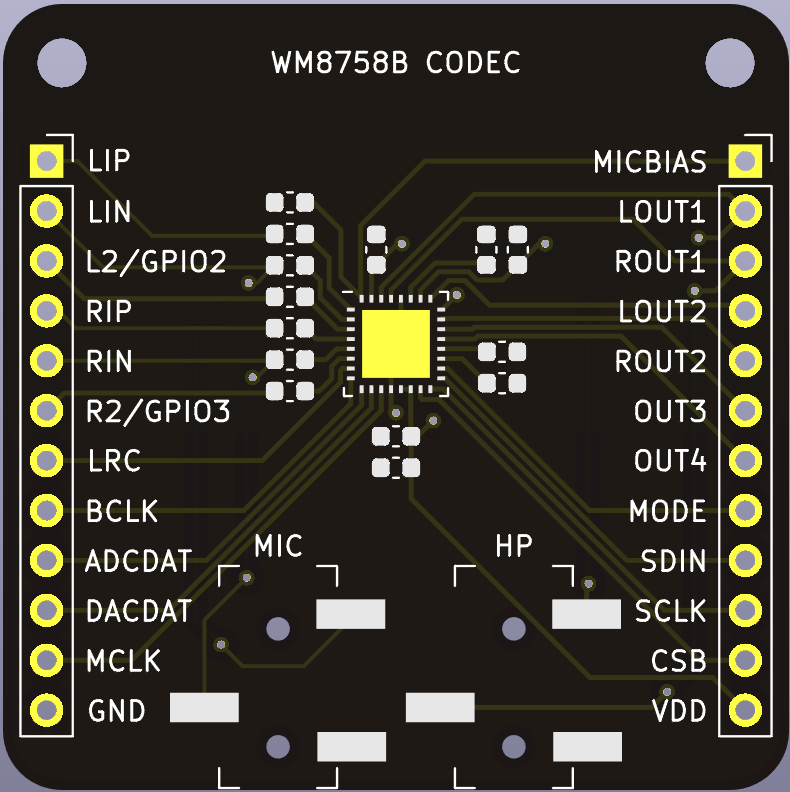

# WM8758b audio codec breakout board

⚠️ __Warning:__ The WM8758b has been [discontinued](https://www.cirrus.com/products/eol/).

 

A breakout board for the [WM8758b audio codec](datasheets/1811051126_Cirrus-Logic-WM8758CBGEFL-RV_C323840.pdf) with 3.5mm microphone input and line/headphone output jacks.

## Headers

See [datasheeet](datasheets/1811051126_Cirrus-Logic-WM8758CBGEFL-RV_C323840.pdf).

## Connectors

* __MIC__ - Stereo microphone input
* __HP__ - Line/headphone output

## Hand soldered components

* 1x12 2.54 mm headers
* 1x12 2.54 mm headers