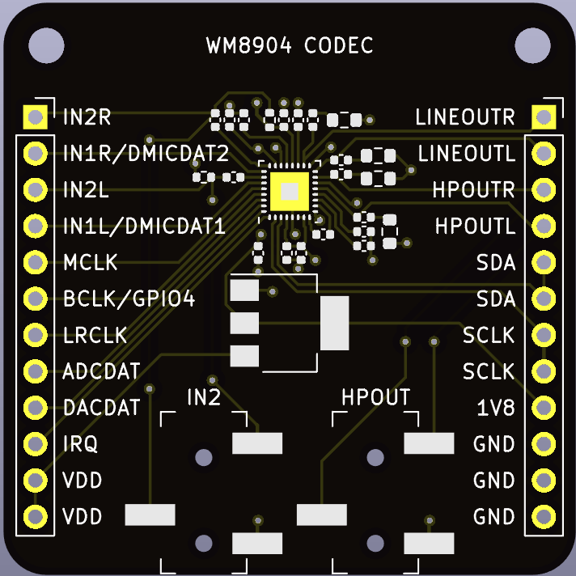

# WM8904 audio codec breakout board

 

A breakout board for the [WM8904 audio codec](datasheets/1912111437_Cirrus-Logic-WM8904CGEFL-RV_C323845.pdf) with 3.5mm microphone input and line/headphone output jacks.

## Headers

* __VDD__ - Supply voltage,  3.3V - 12V 
* __1V8__ - 1.8V codec supply voltage. Should typically not be connected.

See [datasheeet](datasheets/1912111437_Cirrus-Logic-WM8904CGEFL-RV_C323845.pdf) for the other pins.

## Connectors

* __MIC__ - Stereo microphone input
* __HP__ - Line/headphone output

## Hand soldered components

* 1x12 2.54 mm headers
* 1x12 2.54 mm headers
